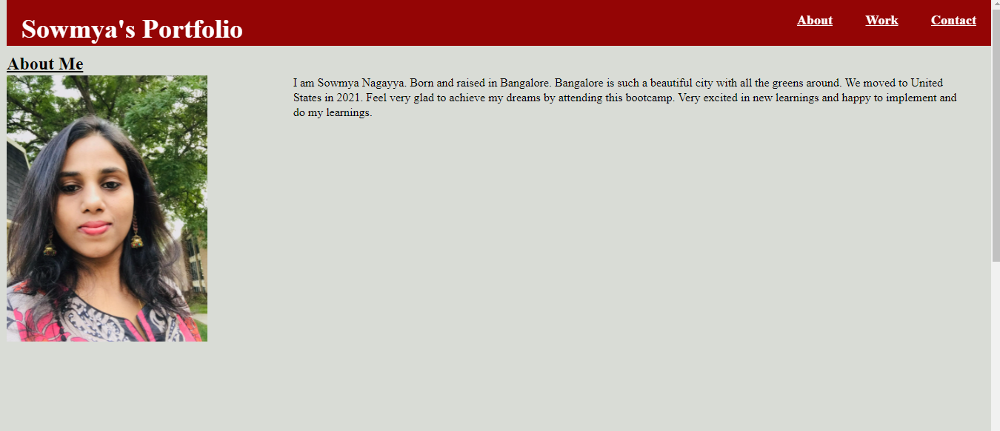
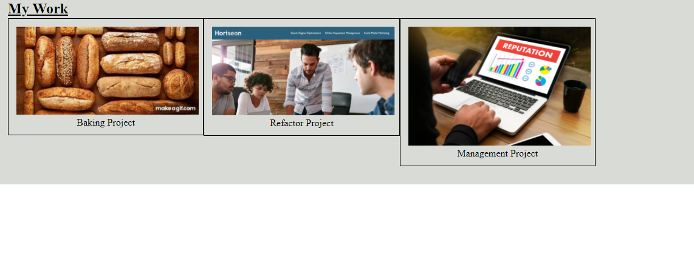
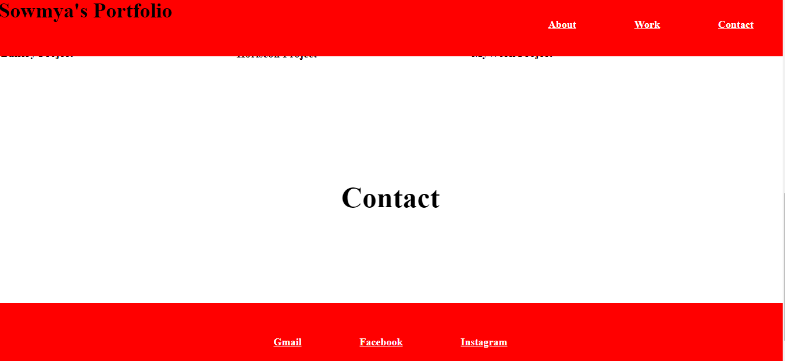

# Homework 2: hw02

## objectives
 
The objective of assignment is to create Portfolio of About Me, My Work and My Contact 
I have done my 3 projects 
1.Baking Project
2.Refactoring Project
3.Management Project
--Click one of the links in the navigation
THEN the UI scrolls to the corresponding section
--Click on the link to the section about their work
THEN the UI scrolls to a section with titled images 
--Click on the images of the applications
THEN it takes to that deployed application
UI is designed to be responsive.

## Screenshot of homepage

You can also refer to this [GitHub Pages](https://github.com/SowmyaNagayya/hw02).

